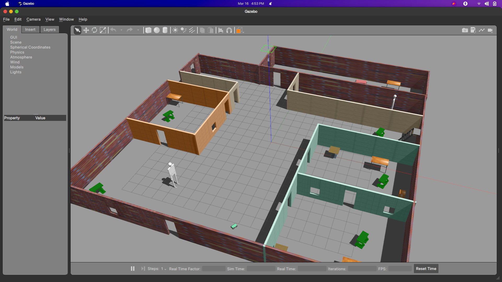

# Project 1: Build My World
Custom Gazebo world designed and built using the Building Editor tool, and an object created with the Moderator tool
Includes models from Gazebo online library, and a custom plugin to display a message when simulation starts.



To start the project, run in the project root directory (e.g. `~/project/`)
```
$ export GAZEBO_PLUGIN_PATH=${GAZEBO_PLUGIN_PATH}:~/project/build
$ gazebo world/office
```