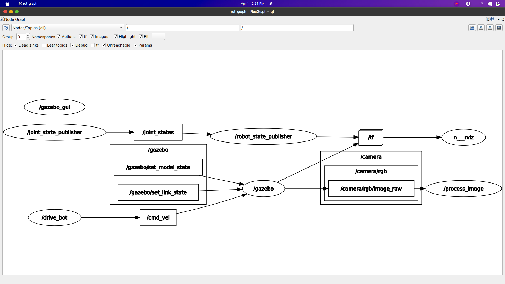

# Go Chase It
The aim of the project is to make robot follow while ball by using it's camera.

<p align="center">
  
  <br>Robot chasing the white ball
</p>

<p align="center">
  
  <br>Rosgraph of the project
</p>

## How to use
```bash
roslaunch my_robot world.launch
roslaunch ball_chaser ball_chaser.launch
rosrun rqt_image_view rqt_image_view
```
