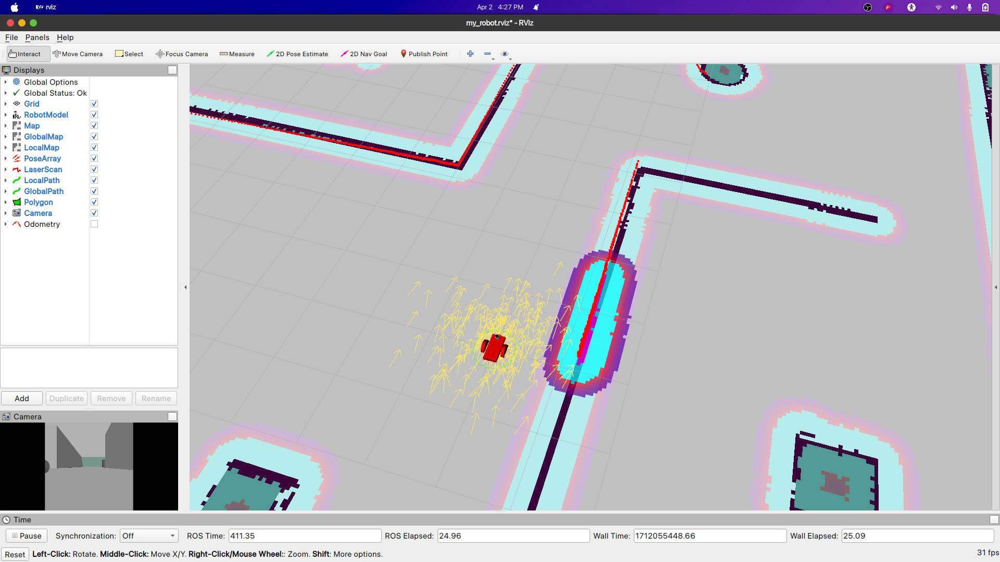
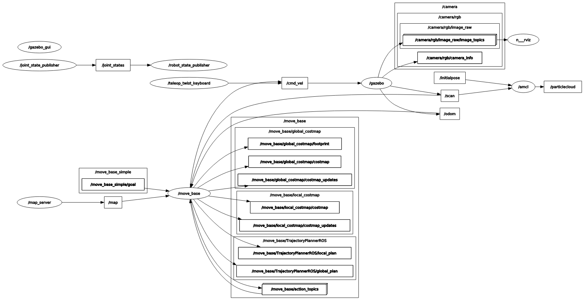

# Where Am I?

<p align="center">
  
  <br>Robot is navigating autonomously
</p>

## Rviz
<p align="center">
  
  <br>Screenshot of Rviz
</p>

## 1. Using Teleop Package
<p align="center">
  
  <br>Using teleop_twist_keyboard package to navigate and map the world.
</p>

## 2. Sending 2D Navigation Goal
<p align="center">
  
  <br>Using 2D Navigation goal to autonomously map and localize the environment
</p>

## Rqt_graph
<p align="center">
  
  <br>Rosgraph of the project
</p>

## How to use
```bash
roslaunch my_robot world.launch
roslaunch my_robot amcl.launch 
```
